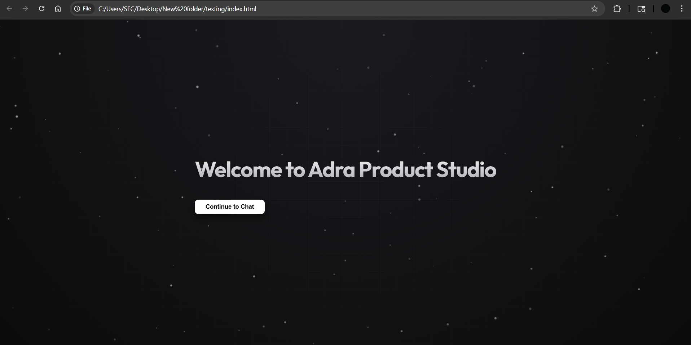
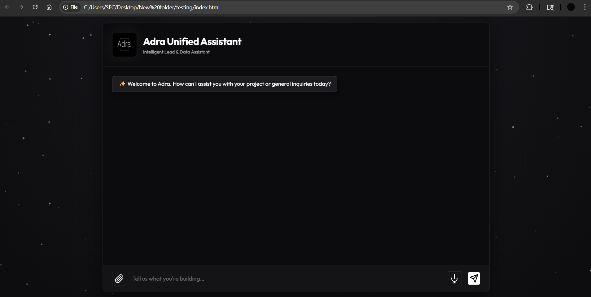
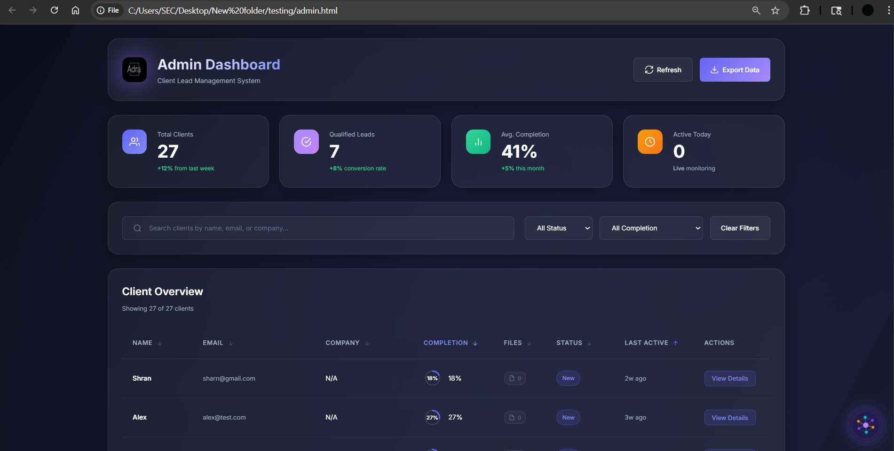
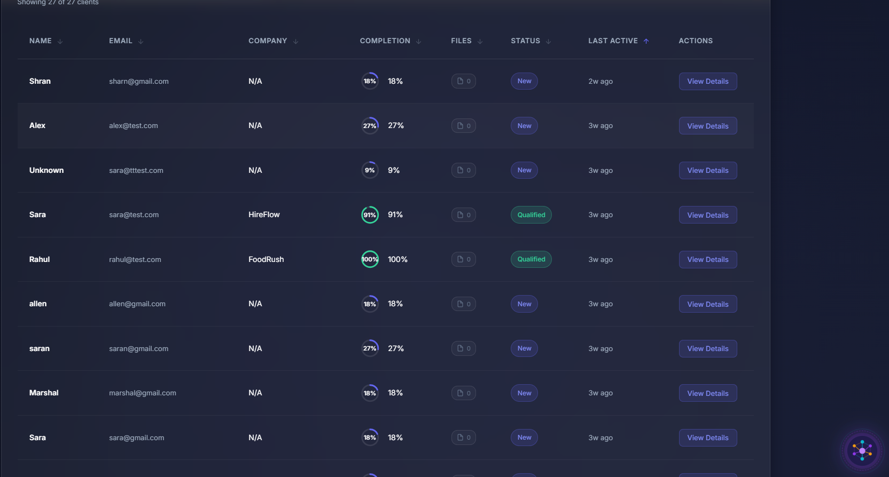
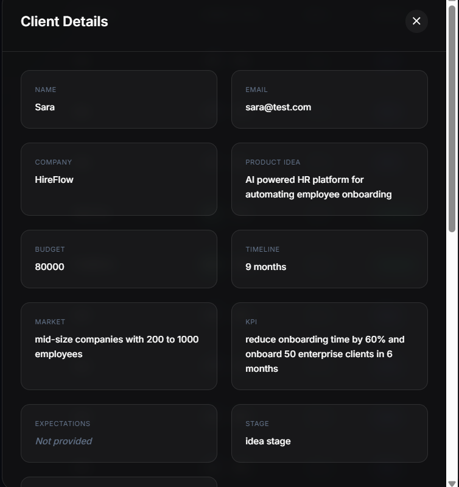
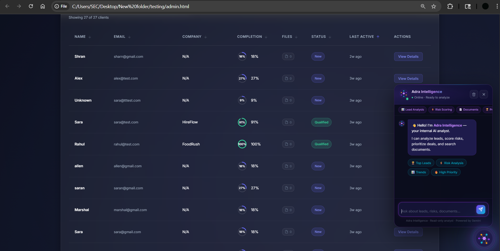
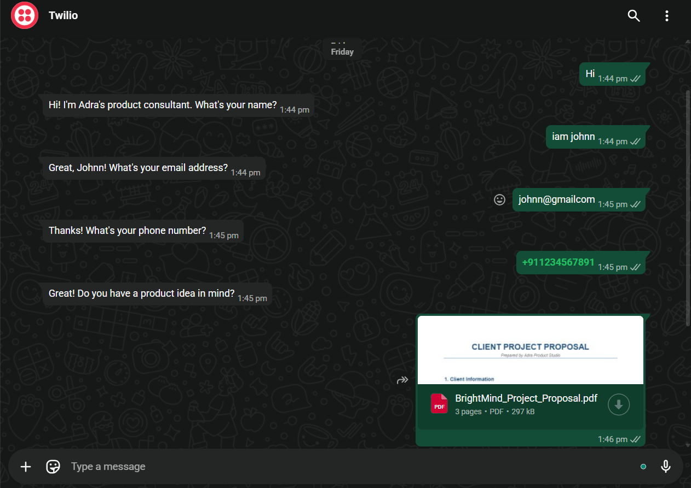
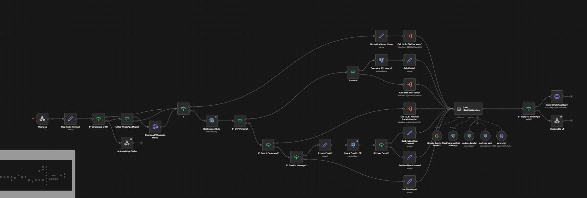

# Adra AI Orchestrator 🚀

Adra is a premium, high-performance AI assistant platform that orchestrates between general-purpose AI (LangGraph/Gemini) and complex business-specific automated workflows (n8n).


*Welcome to Adra Product Studio.*

## ✨ Key Features & Capabilities

Adra is more than just a chatbot; it's a unified intelligence layer for your business.

- **Unified Assistant**: Routes requests between a factual AI layer (Gemini Pro) and deep lead qualification workflows.
- **WhatsApp & Web Multi-Channel**: Fully integrated with WhatsApp (via n8n/Twilio) for asynchronous lead capture.
- **Intelligent Lead Qualification**: Automatically analyzes and scores project ideas, budgets, and timelines using LLM-based extraction.
- **Internal AI Analyst ("Adra Intelligence")**: A dedicated dashboard agent that helps admins search leads, score risks, and identify high-priority deals.
- **Automated Document Processing**: Seamlessly handles file uploads (PDFs/Images) and extracts structured data for your CRM.
- **Premium Real-time Dashboard**: A sleek, dark-mode metrics center for monitoring lead conversion and pipeline health.
- **Voice-Enabled Interface**: Built-in speech recognition for a natural, hands-free user experience.

## 🛠️ Tech Stack & Security

- **Backend**: Python 3.10+, FastAPI, LangChain, LangGraph, Google Gemini AI.
- **Frontend**: Vanilla JavaScript (ES6+), Modern CSS3 (Glassmorphism), HTML5.
- **Automation**: n8n (Orchestration & Integration).
- **Database**: Supabase / PostgreSQL.
- **Security**: Hardened architecture with dynamic server-side configuration using a secure `/config` endpoint.

---

## ⚡ Recent Evolution & Improvements

We recently upgraded the platform with several critical enhancements:

- **n8n Subdomain Migration**: Successfully transitioned to the `vinod2` account for improved reliability and faster execution.
- **Security Hardening**: Completely removed hardcoded API keys and secrets from the frontend. All sensitive data is now managed via server-side `.env` files.
- **Dynamic Configuration**: Implemented a secure backend-to-frontend configuration bridge to prevent secret leakage in public repositories.
- **Production Readiness**: Initialized a clean GitHub repository with professional documentation and protection against secret leaks.

---

## 📸 Project Gallery

### 1. Adra Product Studio Landing Page
**A Stunning First Impression**  
The entry point to the Adra ecosystem features a minimal, high-impact design that sets the tone for the premium experience within. Optimized for conversion, this landing page serves as a high-speed gateway that invites users to engage with either the AI Chatbot or the Admin Dashboard, depending on their role and intent.


### 2. Unified Assistant Interface
**The Premium Client-Facing Experience**  
Our primary web-based chat assistant offers a seamless, interactive experience for end-users. Combining Google's Gemini Pro for general reasoning with our custom n8n workflows for specialized tasks, the assistant provides a "unified" interface that responds to any user need with millisecond-latency and stunning visual feedback.


### 3. Admin Dashboard Overview
**Real-Time Lifecycle Monitoring**  
The administrative control center provides a bird's-eye view of your entire business pipeline. Built with a modern, glassmorphism-inspired design, the dashboard features real-time performance metrics including Total Clients, Qualification Rates, and Average Onboarding Completion. This allows decision-makers to monitor growth and operational efficiency at a single glance.


### 4. Advanced Lead Management & Filtering
**Scalable Pipeline Organization**  
As your client base grows, organization becomes critical. Adra's management interface allows admins to search, sort, and filter leads based on their current status (New, Qualified, Rejected, etc.) and completion stage. This ensures that no high-priority deal is ever lost and that the sales team can focus their energy where it matters most—on the hottest leads.


### 5. Deep Client Intelligence
**Structured Insights from Unstructured Conversations**  
This view showcases the power of our data extraction logic. Adra's AI processes conversational logs and uploaded documents to populate a structured "Client Details" profile. Categories such as Product Idea, Budget, Timeline, and KPIs are automatically extracted with high precision, providing internal teams with actionable insights for project scoping and risk assessment.


### 6. Adra Intelligence (Internal AI Analyst)
**Data-Driven Decision Making**  
The "Adra Intelligence" widget is a specialized internal-facing assistant designed for data analysts. It can autonomously search through your entire lead database to identify trends, perform risk scoring on new deals, and prioritize tasks based on commercial value. This internal layer turns raw client data into a strategic intelligence asset for the company.


### 7. WhatsApp Conversational Lead Capture
**Seamless User Onboarding via Twilio & n8n**  
This module leverages the Twilio API to turn WhatsApp into a powerful lead extraction tool. The underlying n8n engine manages a stateful conversation that guides users through a professional intake process—collecting contact information, validating phone numbers, and even processing high-context PDF project proposals. This ensures a friction-less entry point for potential clients directly from their mobile devices.


### 8. n8n Orchestration Workflow
**The "Brain" of the Multi-Channel Pipeline**  
This complex orchestration layer serves as the central nervous system of Adra. It features sophisticated routing logic that distinguishes between general inquiries and high-value lead captures. The workflow is built with a modular architecture, utilizing specialized sub-workflows for binary file processing, OTP verification, and deep LLM-based lead scoring, ensuring 100% data integrity throughout the lifecycle.


---

## 🚀 Getting Started

### 1. Installation
```bash
git clone https://github.com/vinodkumar-s/Adra-AI-Orchestrator.git
cd Adra-AI-Orchestrator
pip install -r requirements.txt
```

### 2. Environment Setup
Create a `.env` file with the following keys:
- `GOOGLE_API_KEY`
- `TAVILY_API_KEY`
- `N8N_WEBHOOK_URL`
- `SUPABASE_URL`
- `SUPABASE_ANON_KEY`
- `ADMIN_AI_WEBHOOK_URL`

### 3. Run
```bash
python agent_server.py
```

---
