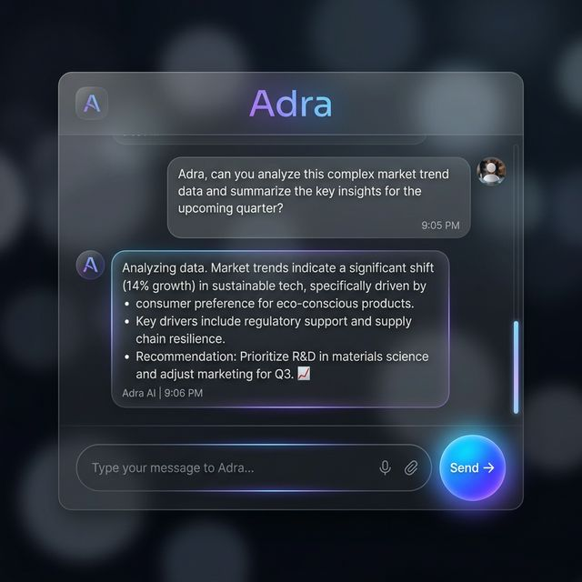

# Adra AI Orchestrator 🚀

Adra is a premium, high-performance AI assistant platform designed to orchestrate complex interactions between users, intelligent agents, and automated workflows. It seamlessly bridges the gap between general-purpose AI (LangGraph/Gemini) and business-specific automation (n8n).


*Capture: The intelligent chat interface in action.*

## ✨ Key Features

- **Hybrid Intelligence**: Automatically routes requests between a factual AI agent (LangGraph) and lead qualification workflows (n8n).
- **Streaming Responses**: Real-time message delivery for a smooth, interactive experience.
- **n8n Workflow Integration**: Full support for n8n webhooks, including file processing and complex state management.
- **Premium UI/UX**: Sleek, modern glassmorphism design with responsive animations and gesture support.
- **Admin Dashboard**: Dedicated interface for managing leads, tracking qualification progress, and viewing uploaded files.
- **Voice-to-Text**: Built-in speech recognition for hands-free interaction.
- **Dynamic Tools**: Integrated tools for Google Search, Wikipedia, calculations, and world time.

## 🛠️ Tech Stack

- **Backend**: Python 3.10+, FastAPI, LangChain, LangGraph, Google Gemini AI.
- **Frontend**: Vanilla JavaScript (ES6+), Modern CSS3, HTML5.
- **Automation**: n8n (for business logic and integrations).
- **Database**: Supabase / PostgreSQL.

## 🚀 Getting Started

### 1. Prerequisites
- Python installed on your machine.
- An n8n account (and a functional chatbot workflow).
- API Keys for Google (Gemini), Tavily, and Supabase.

### 2. Installation
```bash
# Clone the repository
git clone https://github.com/vinodkumar-s/Adra-AI-Orchestrator.git

# Navigate to the project directory
cd Adra-AI-Orchestrator

# Install dependencies
pip install -r requirements.txt
```

### 3. Environment Setup
Create a `.env` file in the root directory and add your keys:
```env
GOOGLE_API_KEY=your_google_key
TAVILY_API_KEY=your_tavily_key
N8N_WEBHOOK_URL=your_n8n_url
SUPABASE_URL=your_supabase_url
SUPABASE_ANON_KEY=your_supabase_key
```

### 4. Running the App
```bash
python agent_server.py
```
Open `index.html` or visit `http://localhost:8000` in your browser.

## 📁 Project Structure

- `agent_server.py`: The heart of the platform - FastAPI orchestrator.
- `app_v4.js`: Main chat interface logic and API communication.
- `admin.js`: Lead management dashboard logic.
- `n8n file/`: Contains the n8n JSON workflows for easy import.
- `styles.css`: Premium animations and styling.

## 🤝 Contributing
Contributions are welcome! Please feel free to submit a Pull Request.

---
*Built with ❤️ for Adra Product Studio.*
